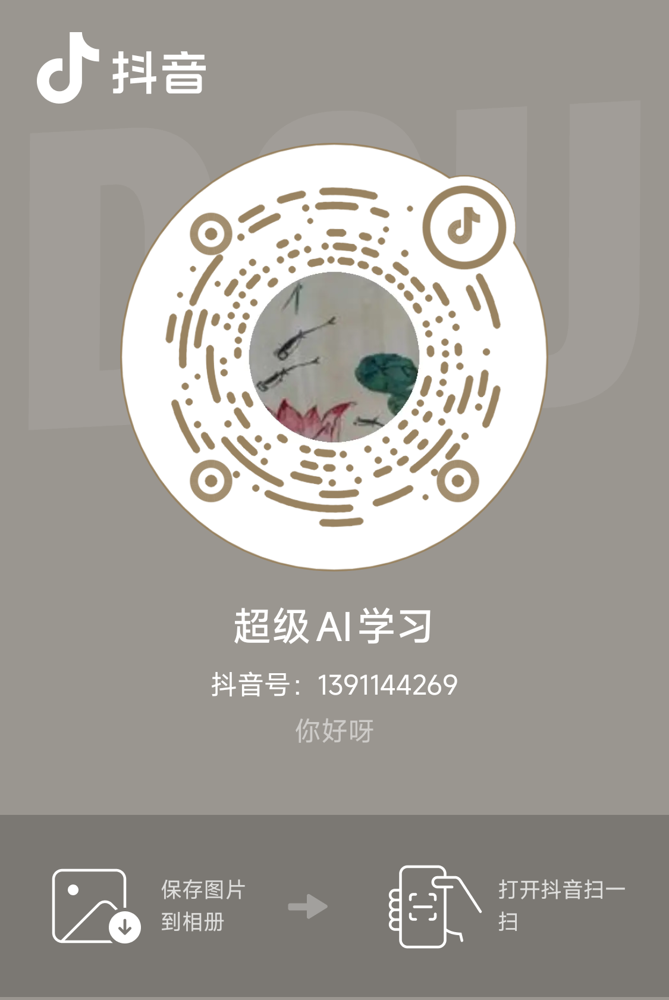
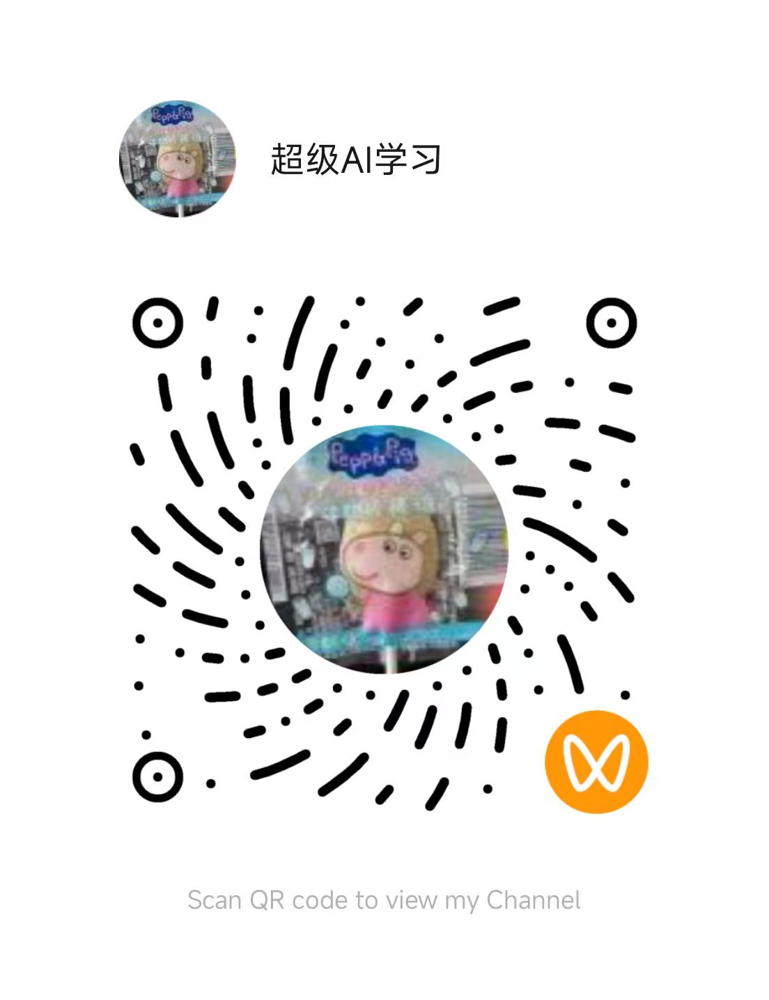

# web samples

各类 Web 小项目与游戏示例合集。

## 关注我 / Follow Me

| 抖音 / TikTok (Douyin) | 视频号 / WeChat Channels |
| :---: | :---: |
|  |  |

## 免责声明

1. 本仓库中包含大量受版权保护的内容（包括但不限于游戏素材、图片、音频、角色形象、名称及商标等），其版权归各自的权利人所有。
2. 本仓库仅供个人学习与技术研究使用，**严禁用于任何商业用途**。
3. 任何人对本仓库内容进行复制、转载、分发、传播或部署公开访问，由此产生的一切侵权问题及法律责任均由使用者自行承担，与本仓库作者无关。
4. 如果您是相关内容的权利人，认为本仓库侵犯了您的合法权益，请联系作者，我们将及时删除相关内容。
5. 下载、克隆或使用本仓库内容，即表示您已阅读并同意上述声明。

## Disclaimer

1. This repository contains a large amount of copyrighted material (including but not limited to game assets, images, audio, characters, names and trademarks). All copyrights belong to their respective owners.
2. This repository is intended for personal learning and technical research only. **Any commercial use is strictly prohibited.**
3. Anyone who copies, reposts, distributes, shares or publicly deploys the contents of this repository is solely responsible for any resulting copyright infringement and legal liability. The author of this repository assumes no responsibility.
4. If you are a rights holder and believe this repository infringes your legitimate rights, please contact the author and the relevant content will be removed promptly.
5. By downloading, cloning or using the contents of this repository, you acknowledge that you have read and agree to this disclaimer.
